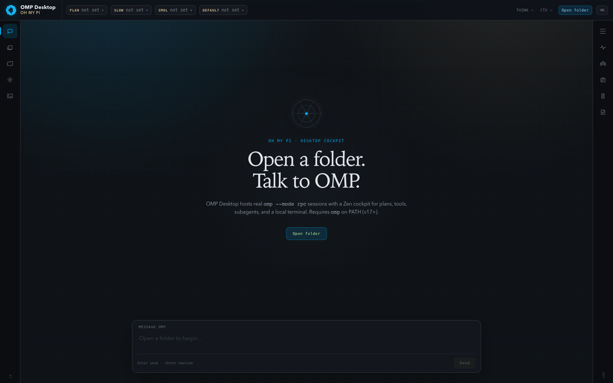
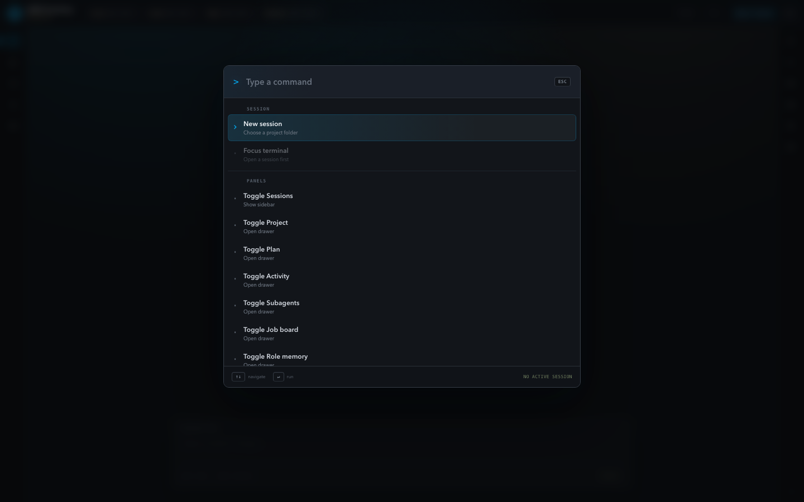
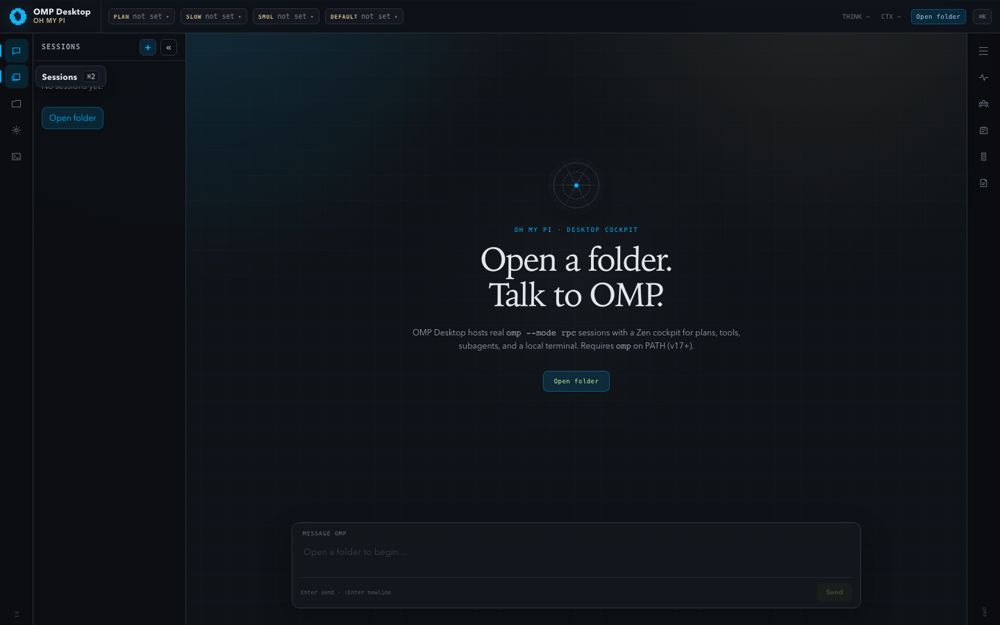
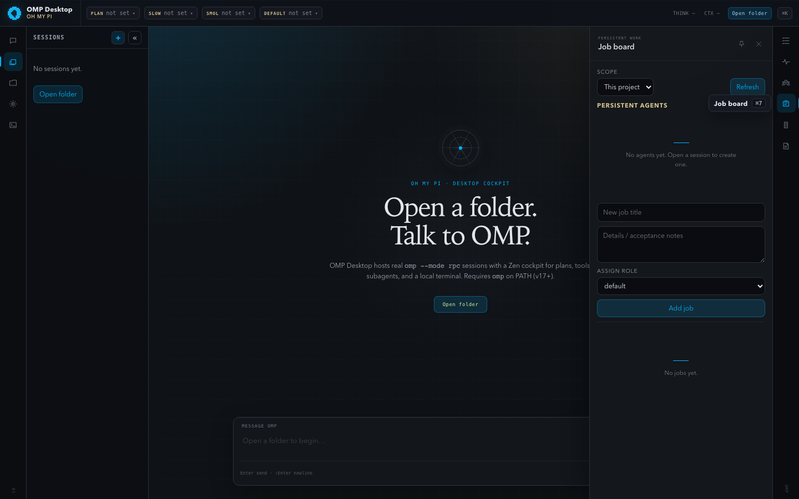
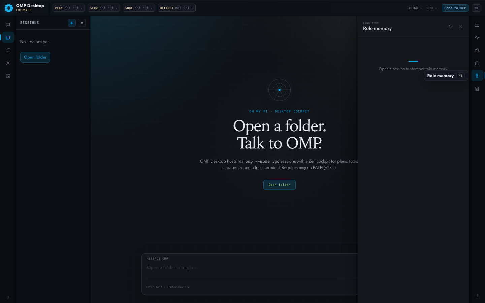
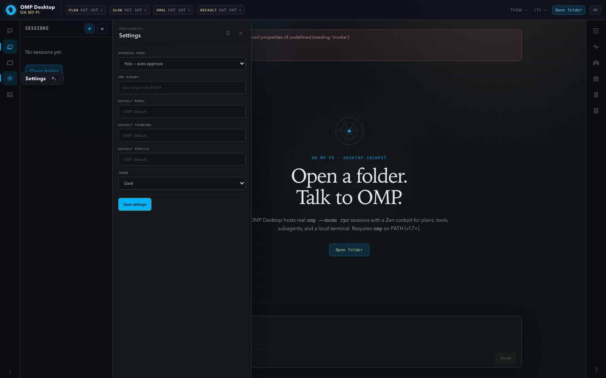

# OMP Desktop

macOS (Apple Silicon) desktop cockpit for [OMP](https://github.com/) (`omp` CLI) coding-agent sessions.

Zen-default UI with expandable panels, multi-tab `omp --mode rpc` sessions, live transcript, plan/activity/subagents, settings, command palette, and an app-owned PTY terminal.

## Requirements

- macOS Apple Silicon
- Rust toolchain (`rustc` / `cargo`)
- Node.js 20+ and npm
- [Tauri 2 system dependencies](https://v2.tauri.app/start/prerequisites/)
- `omp` on PATH (v17+), or set the binary path in Settings


## Screenshots

Captured from the live desktop UI:













More views live in [`docs/screenshots/`](docs/screenshots/).

## Launch on macOS

Double-click:

```text
Launch OMP Desktop.command
```

Or from a terminal in the project root:

```bash
npm run start
# same as: npm run dev
```

The first launch installs dependencies if needed, then opens the OMP Desktop window.

## Development

```bash
npm install
npm --prefix ui install
npm run dev
```

Other scripts:

```bash
npm run ui:dev      # Vite only
npm run ui:build    # frontend production build
npm run build       # tauri build
```

Rust tests:

```bash
cd src-tauri && cargo test
```

## Architecture

- **Rust / Tauri host** (`src-tauri/`): spawns one `omp --mode rpc` child per session tab, JSONL RPC client, settings, PTY, Tauri commands + `omp-event` bridge.
- **React UI** (`ui/`): Zen shell, transcript/composer, pinnable panels, palette, xterm terminal view.
- **OMP** remains source of truth for agent loop, tools, session files, and auth.

## Defaults

- Approval mode: **yolo** (`--approval-mode yolo` + `--auto-approve`) unless changed in Settings.
- Layout: Zen (icon rails); click to drawer, pin to dock.
- Terminal: app-owned PTY per session (not the OMP TUI).

## Manual QA checklist

1. App launches via `npm run dev`
2. Open folder → session becomes ready
3. Prompt streams assistant text
4. Coding prompt shows tool cards
5. Two tabs on two folders stay isolated
6. Plan panel updates when OMP todos change
7. Activity lists tools
8. Terminal `pwd` matches session cwd
9. Yolo path shows no approval chrome
10. Settings → approval mode persists for next session
11. Kill omp child → exited banner + Restart works
12. Missing `omp` → error points at Settings / PATH

## Repo

https://github.com/MTEnt/omp-desktop
